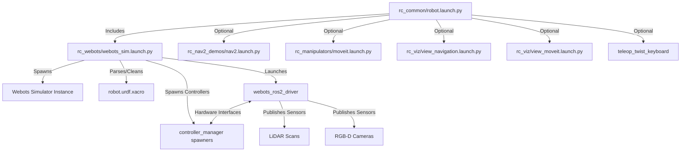

# Webots Simulation Architecture Guide

This document describes the architecture of the **A300 Mobile Manipulator Robot (MMR)** Webots simulation setup, explaining how the components interact, how they are executed, and where to make modifications to adapt or extend the robot's functionality.

---

## 🏛️ Simulation Architecture Overview

The simulation is built using standard ROS 2 (Jazzy Jalisco) and **Webots**. It integrates:
- **Mobile Base Control:** A300 base with mecanum/differential velocity controls driven by `ros2_control`.
- **Manipulator Control:** UR5e robotic arm with a Robotiq 2F-140 gripper planned via **MoveIt 2**.
- **Navigation & SLAM:** **Nav2** stack for navigation, localization, and **SLAM Toolbox** for mapping.
- **Visualizers:** RViz configuration dashboards tailored for navigation and manipulation.



---

## 📁 Key Packages and Configuration Files

The workspace is organized into modular packages under `workspace/src/rc_mmr_sim/`:

1. **`rc_common`**
   - **`launch/robot.launch.py`**: The unified main launch entrypoint.
   - **`robot.urdf.xacro`**: The top-level robot model combining base, arm, and sensors.
   - **`robot.srdf`**: MoveIt semantic representation defining self-collision disable rules.
2. **`rc_webots`**
   - **`launch/webots_sim.launch.py`**: Preprocesses the URDF and initializes Webots simulator/controller nodes.
   - **`config/webots_control.yaml`**: ROS 2 Control Manager configurations (velocity, joint trajectory, and gripper controller parameters).
   - **`worlds/universal_robot.wbt`**: The Webots simulation world file.
3. **`rc_sensors_description`**
   - **`urdf/intel_realsense.urdf.xacro`**: RealSense camera model, configuring RGB cameras and depth `RangeFinder` sensors.
   - **`urdf/hokuyo_ust.urdf.xacro`**: Hokuyo 2D LiDAR model and Webots device configuration.
4. **`rc_nav2_demos`**
   - Holds configurations (`config/a300/`), maps (`maps/`), and launch files for Navigation, SLAM, and localization.
5. **`rc_manipulators`**
   - Holds configuration, kinematic settings, and launch scripts for MoveIt 2.

---

## ⚙️ URDF Preprocessing in Webots Launch

Webots parses URDFs differently than Gazebo. Inside `webots_sim.launch.py`, the URDF (`robot.urdf.xacro`) is processed dynamically at runtime:
1. **Mesh Path Resolution:** Strips `file://` prefixes so Webots resolves absolute Unix paths. Resolves `package://` paths using `ament_index_python`.
2. **Control Plugin Translation:** Swaps out `<plugin>gz_ros2_control/GazeboSimSystem</plugin>` or `<plugin>ign_ros2_control/IgnitionSystem</plugin>` with Webots-compatible plugins (`webots_ros2_control::Ros2ControlSystem`).
3. **XML Structure Merger:** Merges all separate `<webots>` XML tags and ros2_control joint lists into single unified blocks so the Webots driver initializes them correctly.

---

## 🛠️ Developer Guide: How to Achieve Tasks

### 1. Modifying or Adding a Sensor
If you want to mount a new sensor or adjust an existing one:
1. **Define the geometry and joints** in the sensor's Xacro file (under `rc_sensors_description/urdf/`).
2. **Configure the Webots ROS 2 integration** within the `<webots>` XML tag of the URDF. For example, a depth sensor uses the Webots `RangeFinder` device:
   ```xml
   <webots>
     <device reference="camera_0_depth" type="RangeFinder">
       <ros>
         <enabled>true</enabled>
         <topicName>$(arg namespace)/sensors/camera_0/depth</topicName>
         <alwaysOn>true</alwaysOn>
         <frameName>camera_0_color_optical_frame</frameName>
       </ros>
       <minRange>0.1</minRange>
       <maxRange>20.0</maxRange>
     </device>
   </webots>
   ```
3. **Attach the sensor** to your parent link inside `rc_common/robot.urdf.xacro`.
4. **Remap the topics** inside `webots_sim.launch.py` to route them correctly.

### 2. Fixing MoveIt Self-Collisions
When attaching new parts to the robot arm or base, MoveIt might report start-state collisions.
1. Identify the colliding link names from the terminal logs (e.g. `arm_0_wrist_3_link` and your camera link).
2. Open [robot.srdf](file:///home/adyansh/rc_robocup/workspace/src/rc_mmr_sim/rc_common/robot.srdf).
3. Add a collision exception rule:
   ```xml
   <disable_collisions link1="arm_0_wrist_3_link" link2="camera_1_link" reason="Adjacent" />
   ```

### 3. Creating and Loading a New Map
1. Run the mapping mode:
   ```bash
   ros2 launch rc_common robot.launch.py mapping:=true teleop:=true
   ```
2. Navigate the robot using the pop-up keyboard utility to map the area.
3. Save the map files (`my_map.yaml` and `my_map.pgm`) using:
   ```bash
   ros2 run nav2_map_server map_saver_cli -f "my_map" --ros-args -p map_subscribe_transient_local:=true -r __ns:=/rc
   ```
4. Copy the saved map files to `rc_nav2_demos/maps/` and specify the map file path using the `map` argument of your launch command.

---

## 🚀 How to Run

Run the simulation and helper stacks via the main entrypoint:

```bash
ros2 launch rc_common robot.launch.py [arguments]
```

### Configurable Launch Arguments:
- `mapping` (default: `false`): Set to `true` to run SLAM mapping. Disables MoveIt components automatically.
- `nav2` (default: `true`): Set to `false` to disable the navigation stack.
- `moveit` (default: `true`): Set to `false` to disable the MoveIt arm controls.
- `rviz` (default: `true`): Set to `false` to suppress visualizer GUI windows.
- `teleop` (default: `false`): Set to `true` to pop open the teleoperation keyboard in a separate window.
- `map` (default: `my_map.yaml` path): Path to the `.yaml` file of the saved map.
- `use_sim_time` (default: `true`): Forces nodes to synchronize clocks with the simulator.
